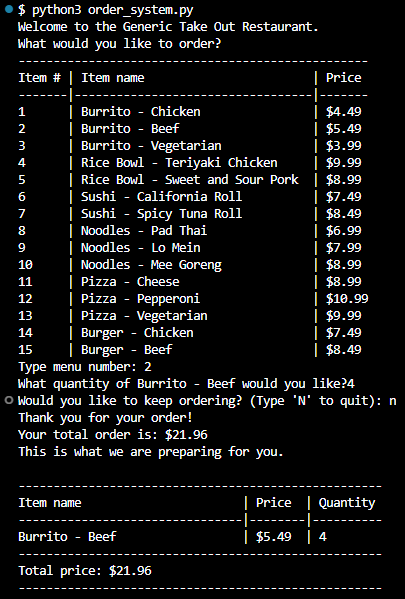

<div align="center">

[](https://opensource.org/licenses/MIT)


</div> 


<div align="center">
  <a href="https://github.com/BriannaVitan/Restaurant-Menu-Order">
  <!--  Correct this file path to a logo if you would like one; otherwise, delete this a href -->
  </a>

<!--  Edit App name -->
  <h3 align="center">Restaurant Menu Order</h3>

  <p align="center">
  <!--  Edit App description -->
    This program allows customers to place orders with a takeout restaurant and recieve an itemized recept. 
<!-- PROJECT LOGO -->
<br />
    <a href="https://github.com/BriannaVitan/Restaurant-Menu-Order"><strong>Explore the docs »</strong></a>
    <br />
    <br />
    <!-- Edit deployment link -->
    <a href="">View Demo(Coming Soon)</a>
    ·
    <a href="https://github.com/BriannaVitan/Restaurant-Menu-Order/issues">Report Bug</a>
    ·
    <a href="https://github.com/BriannaVitan/Restaurant-Menu-Order/issues">Request Feature</a>

  </p>
</div>

<!-- TABLE OF CONTENTS -->
<details>
  <summary>Table of Contents</summary>
  <ol>
    <li>
      <a href="#about-the-project">About The Project</a>
      <ul>
        <li><a href="#built-with">Built With</a></li>
      </ul>
    </li>
    <li>
      <a href="#getting-started">Getting Started</a>
      <ul>
        <li><a href="#installation">Installation</a></li>
      </ul>
    </li>
    <li><a href="#usage">Usage</a></li>
    <li><a href="#contributing">Contributing</a></li>
    <li><a href="#license">License</a></li>
    <li><a href="#contact">Contact</a></li>
     <li><a href="#project-links">Project Links</a></li>
  </ol>
</details>

<!-- ABOUT THE PROJECT -->

## About The Project

<!--  Add your screenshots or demo videos here -->
<!-- Add screenshots using the following format: -->
<!--  -->
<!-- Add video demos using the following format: -->
<!--  -->

This project was built using Python.
### Built With

<div align="center">

<!--  Add any additional badges as needed. For more info, visit: https://github.com/404pandas/empty-resources/blob/main/assets/images/shields.md -->

[](https://code.visualstudio.com/docs)
[](https://www.pythonlang.org/)


</div>

<!-- GETTING STARTED -->

## Getting Started

Once completely built, this application will function as a deployed app on Render.

### Local Installation / Testing

1. Clone the rep

```
git clone https://github.com/BriannaVitan/Restaurant-Menu-Order
```

2. Build the database 

```
python3 order_systems.py
```

See the [open issues](https://github.com/BriannaVitan/Restaurant-Menu-Order/issues) for a full list of proposed features (and known issues).

<!-- CONTRIBUTING -->

## Contributing

Contributions are what make the open source community such an amazing place to learn, inspire, and create. Any contributions you make are **greatly appreciated**.

If you have a suggestion that would make this better, please fork the repo and create a pull request. You can also simply open an issue with the tag "enhancement".
Don't forget to give the project a star! Thanks again!!

## Usage



<!-- LICENSE -->

## License

This project is licensed under the MIT license.

<!-- CONTACT -->

## Contact

<!--  Add your name, portfolio link, and email if you would like here -->

[Brianna Vitan]() - briannavitan@gmail.com

## Project Links:

[Github Repository](https://github.com/BriannaVitan/Restaurant-Menu-Order)
